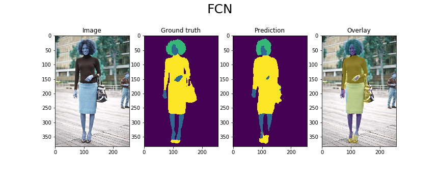
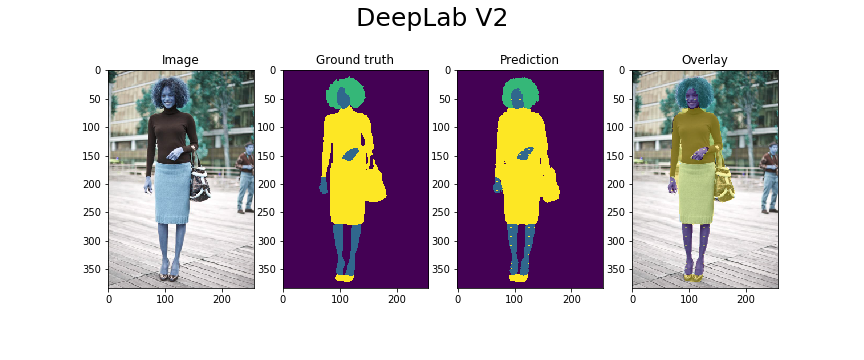
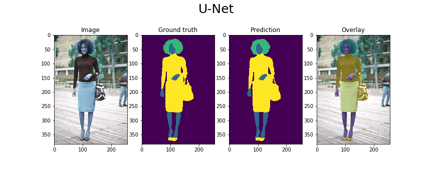
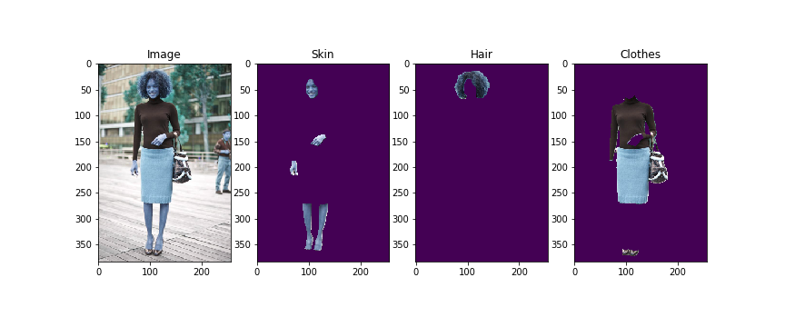

Clothing Segmentation
===
Clothing Segmentation using deep learning.

First, after preprocessing the clothing dataset, four classes(backgrounds, skin, hiar, clothes) were segmented using deep neural network models(FCN, DeepLab, U-Net).
 
Datasets
---
Clothing Co-Parsing(CCP) dataset that i used can be found https://github.com/bearpaw/clothing-co-parsing.

Pre-Processing
---
After importing the image data from the alpha channel, convert unsigned int image to int and resize 64 x 64.

Models
---
Models are found in model file. Model file includes FCN.py, DeepLabV2.py, UNet.py.
U-Net has shown the best performance among the models in this project. 

Requirement
---
* Python
* Keras
* Python packages : numpy, matplotlib, opencv, and so on...

Usage
---
In order to preprocessing the data, download the dataset from [this](https://github.com/bearpaw/clothing-co-parsing).

Then copy the annotation and photo files into the same path as pre_processing.py or pre_processing.ipynb in the download file.

After that you copy files, you can implement the codes. 
You can use Segmentation.py to get a segmented image.

### Pre-Processing
`python pre_processing.py`

### train and test
`python run_main.py --model unet`

`python segmentation.py --model_path ./save_model/UNet_model.h5 --image_path ./MyFile/example.png`

Results
---
### Implementation results by each model.

### Results by U-Net model.

Reference Implementations
---
+ https://github.com/aurora95/Keras-FCN
+ https://github.com/DavideA/deeplabv2-keras
+ https://github.com/zhixuhao/unet